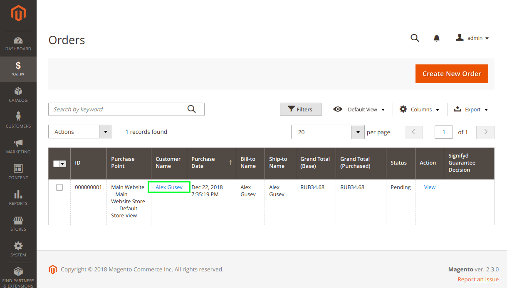
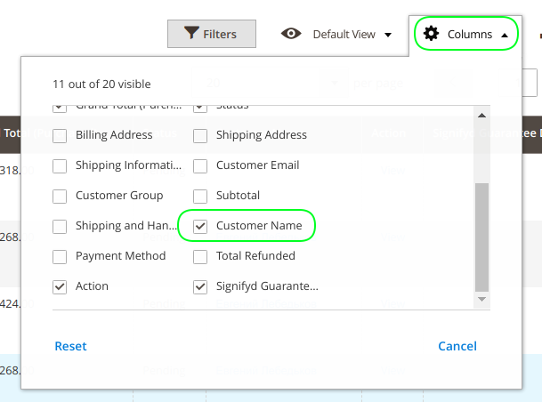

# mage2_ext_grid_column_renderer

Example of the grid's column renderer with link to the customer card.

You need to enable 'Customer Name' column if you don't see it in the grid:

## Install

### From console

    $ cd ${DIR_MAGE_ROOT}   // go to Magento 2 root folder ('composer.json' file should be placed there)
    $ composer require flancer32/mage2_ext_grid_column_renderer
    $ bin/magento module:enable Flancer32_GridLink
    $ bin/magento setup:upgrade
    $ bin/magento setup:di:compile

### Using 'composer.json'

    "require": {
        "flancer32/mage2_ext_grid_column_renderer": "^0.1"
    }